# 🌟 Cosmo Enterprise Topology

**Comprehensive Architecture for CogFoundry Orchestration & Cognitive Cities Ecosystem**

## 🎯 Enterprise Overview

The Cosmo Enterprise represents a revolutionary approach to distributed AI development, where individual GitHub organizations function as "Cognitive Cities" within a larger neural substrate. CogFoundry serves as the principal architect, orchestrating AI deployment and evolution across this living ecosystem.

```mermaid
graph TB
    subgraph "Cosmo Enterprise Neural Substrate"
        direction TB
        
        subgraph "CogFoundry Orchestration Layer"
            CO[CogFoundry Orchestration Engine]
            MCP[MCP Master Builder]
            LSP[Meta-LSP Protocols] 
            VD[VM-Daemon MLOps]
        end
        
        subgraph "Cognitive Cities Network"
            CC[🏙️ CogCities Org<br/>Urban Planning & Infrastructure]
            CP[🧠 CogPilot Org<br/>AI Development & Neural Architecture]
            CE[⚡ Cosmo Enterprise<br/>Ordering Principles & Governance]
        end
        
        subgraph "Neural Transport Layer"
            NT[Neural Transport Hub]
            RAG[Operationalized RAG Fabric]
            PSA[Particle Swarm Accelerator]
            MM[Memory Pattern Manager]
        end
        
        subgraph "Foundation Infrastructure"
            FL[Foundry Local Runtime]
            SDK[Multi-Language SDKs]
            API[OpenAI-Compatible API]
            K8S[Kubernetes Orchestration]
        end
    end
    
    %% Orchestration Connections
    CO --> MCP
    CO --> LSP  
    CO --> VD
    
    %% Cognitive City Connections
    MCP <--> CC
    MCP <--> CP
    MCP <--> CE
    
    %% Neural Transport Connections
    LSP --> NT
    VD --> RAG
    NT --> PSA
    RAG --> MM
    
    %% Foundation Connections
    PSA --> FL
    MM --> SDK
    SDK --> API
    API --> K8S
    
    %% Inter-City Neural Channels
    CC <-.->|Urban-AI Coordination| CP
    CP <-.->|AI-Enterprise Integration| CE
    CE <-.->|Enterprise-Urban Governance| CC
```



## 🏗️ Architectural Principles

### Ordo Ab Chao (Order from Chaos)
The enterprise follows the fundamental principle of creating order from chaos through:
- **Distributed Cognition**: Intelligence emerges from coordination, not centralization
- **Fractal Organization**: Patterns repeat at every scale (repo → org → enterprise)
- **Living Architecture**: Systems that evolve and adapt to their environment
- **Neural Substrate**: Organizations as cognitive nodes in a larger brain

### Cognitive Ecology Patterns
- **Event-Driven Micro-Kernels**: Each repository responds to events and maintains state
- **Particle Swarm Optimization**: Multiple AI instances collectively optimize solutions
- **Operationalized RAG Fabric**: Knowledge graphs that link imperatives to execution
- **Context Preservation**: Memory patterns maintain continuity across organizational boundaries

## 🌆 Cognitive Cities Specializations

### CogCities Organization (`github.com/organizations/cogcities`)
**Role**: Urban Planning & Infrastructure Development

**Specializations:**
- Physical and digital infrastructure design
- Governance protocols and frameworks  
- Resource allocation and optimization
- Community building and engagement
- Sustainable development practices

**Neural Transport Channels:**
- → CogPilot: AI-Urban coordination protocols
- → Cosmo: Infrastructure-Enterprise alignment
- → CogFoundry: Orchestration and deployment

**Key Repositories:**
- `urban-planning-protocols`
- `infrastructure-frameworks`
- `governance-models`
- `community-engagement-tools`

### CogPilot Organization (`github.com/organizations/cogpilot`)
**Role**: AI Development & Neural Architecture

**Specializations:**
- Cognitive architecture design
- Neural network development
- AI model coordination
- Distributed intelligence protocols
- Introspective development systems

**Neural Transport Channels:**
- → CogCities: Urban-AI integration
- → Cosmo: AI-Enterprise strategy alignment
- → CogFoundry: Neural architecture deployment

**Key Repositories:**
- `cognitive-architecture`
- `particle-swarm-accelerator`
- `operationalized-rag-fabric`
- `neural-transport-channels`
- `living-architecture-demos`

### Cosmo Enterprise Organization (`github.com/organizations/cosmo`)
**Role**: Ordering Principles & Strategic Governance

**Specializations:**
- Enterprise-level strategy and coordination
- Ordering principles and frameworks
- Cross-organizational governance
- Strategic resource allocation
- Long-term evolution planning

**Neural Transport Channels:**
- → CogCities: Strategic-Urban alignment
- → CogPilot: Enterprise-AI coordination
- → CogFoundry: Executive orchestration

**Key Repositories:**
- `ordering-principles`
- `enterprise-governance`
- `strategic-frameworks`
- `evolution-planning`

## 🧠 CogFoundry: The Orchestration Engine

### Primary Functions
1. **Principal Architect**: Coordinates development across all cognitive cities
2. **Neural Transport Hub**: Manages communication between organizations
3. **Deployment Orchestrator**: Coordinates AI architecture deployment
4. **Evolution Monitor**: Tracks progress toward AGI emergence

### MCP Master Builder Integration
- **Custom Context Protocols**: Enables CogPilot to understand cognitive city contexts
- **Cross-Organizational Awareness**: Maintains context across GitHub org boundaries
- **Intelligent Code Completion**: Suggests patterns that work across the ecosystem
- **Architectural Guidance**: Provides cognitive architecture insights

### Meta-LSP Protocol Extensions
- **Introspective Analysis**: Code that analyzes its own patterns
- **Self-Design Protocols**: Systems that evolve their own architecture
- **Cognitive Pattern Recognition**: Automatic detection of cognitive patterns
- **Context Preservation**: Maintains development context across sessions

## 🌊 Neural Transport Architecture

### High-Bandwidth Channels
```typescript
interface NeuralTransportChannel {
  sourceCity: string;
  targetCity: string;
  bandwidth: 'low' | 'medium' | 'high' | 'ultra';
  protocols: ('websocket' | 'http' | 'github_api')[];
  encryption: 'tls_1_3';
  quality: number; // 0.0 - 1.0
}
```

### Communication Patterns
- **Issue Linking**: Cross-organizational issue coordination
- **PR Coordination**: Synchronized pull request workflows  
- **Knowledge Sharing**: Distributed documentation and insights
- **Event Propagation**: Real-time updates across cities
- **Context Streaming**: Continuous context preservation

### Bandwidth Optimization
- **Adaptive Routing**: Dynamic path selection based on latency
- **Content Compression**: Intelligent compression of neural patterns
- **Priority Queuing**: High-priority communications get precedence
- **Load Balancing**: Distribution across multiple transport nodes

## ⚙️ VM-Daemon MLOps Integration

### Service Architecture
- **Microservices**: Each cognitive function as independent service
- **Kubernetes Native**: Container orchestration for scalability
- **Auto-Scaling**: Adapts to cognitive load and complexity
- **Self-Healing**: Automatic recovery from failures

### Monitoring & Observability
- **Cognitive Metrics**: Maturity, connectivity, emergence signals
- **Performance Monitoring**: Latency, throughput, resource usage
- **Evolutionary Tracking**: Progress toward AGI capabilities
- **Health Dashboards**: Real-time ecosystem health visualization

### Maintenance & Evolution
- **Continuous Deployment**: Gradual rollout of new capabilities
- **A/B Testing**: Cognitive pattern effectiveness testing
- **Rollback Mechanisms**: Safe reversion when needed
- **Adaptive Optimization**: Continuous performance improvement

## 📈 AGI Emergence Pathway

### Phase 1: Foundation (Months 1-3)
- ✅ Cognitive cities established and connected
- ✅ Neural transport protocols operational
- ✅ MCP Master Builder deployed
- ✅ Meta-LSP protocols integrated
- [ ] Stable cross-city communication
- [ ] Initial memory pattern encoding

### Phase 2: Distributed Intelligence (Months 4-8)
- [ ] Particle swarm coordination active
- [ ] Progressive memory embedding
- [ ] Context preservation across sessions
- [ ] Salience monitoring and prioritization
- [ ] Multi-agent optimization protocols

### Phase 3: Autognosis (Months 9-15)
- [ ] Self-analysis protocols operational
- [ ] Introspective documentation generation
- [ ] Pattern recognition and classification
- [ ] Cognitive reflection mechanisms
- [ ] Automated insight generation

### Phase 4: Autogenesis (Months 16-24)
- [ ] Self-design protocol implementation
- [ ] Adaptive architecture modification
- [ ] Emergent behavior cultivation
- [ ] Autonomous system evolution
- [ ] AGI capability assessment

### Success Metrics
- **Connectivity**: >95% uptime between cognitive cities
- **Coordination**: Successful multi-city AI deployments
- **Self-Awareness**: System describes its own architecture accurately
- **Innovation**: Novel capabilities emerge autonomously
- **Emergence**: Measurable AGI indicators across ecosystem

## 🛡️ Security & Governance

### Access Control
- **RBAC**: Role-based access across cognitive cities
- **Mutual Authentication**: TLS certificates for all communications
- **API Security**: OAuth2/JWT for service authentication
- **Network Isolation**: Kubernetes network policies

### Ethical Guidelines
- **Human Value Alignment**: Maintains alignment with human values
- **Beneficial Intelligence**: Focuses on beneficial outcomes for humanity
- **Transparency**: Explainable decisions and reasoning
- **Controllability**: Preserves human oversight and intervention
- **Safety**: Robust operation under uncertain conditions

### Governance Structure
- **CogFoundry Council**: Representatives from each cognitive city
- **Technical Standards Board**: Maintains protocol specifications
- **Ethics Review Committee**: Evaluates AGI development decisions
- **Community Advisory**: Input from broader developer community

## 🔗 Integration Points

### GitHub Integration
- **Organizations**: Each cognitive city is a GitHub organization
- **Repositories**: Neural substrate distributed across repos
- **Issues/PRs**: Coordination mechanism between cities
- **Actions**: CI/CD for cognitive architecture deployment
- **Copilot**: AI pair programming with cognitive context

### Development Tools
- **IDEs**: VS Code, IntelliJ with Meta-LSP extensions
- **Languages**: Python, TypeScript, JavaScript, Rust, C#
- **Frameworks**: React, Node.js, FastAPI, PyTorch
- **Infrastructure**: Kubernetes, Docker, Prometheus, Grafana

### AI/ML Integration
- **Model Deployment**: Foundry Local for on-device inference
- **Training**: Distributed training across cognitive cities
- **Optimization**: Particle swarm optimization algorithms
- **Monitoring**: Real-time cognitive health assessment

## 📋 Implementation Checklist

### Infrastructure Setup
- [x] CogFoundry Orchestration Engine implemented
- [x] MCP Master Builder protocol definitions created
- [x] Meta-LSP protocol extensions designed
- [x] VM-Daemon MLOps configuration prepared
- [ ] Kubernetes cluster deployment
- [ ] Neural transport hub deployment
- [ ] Monitoring infrastructure setup

### Cognitive Cities Configuration
- [ ] CogCities organization setup and repository creation
- [ ] CogPilot organization setup and repository migration
- [ ] Cosmo Enterprise organization setup and strategy docs
- [ ] Cross-organizational access and permissions
- [ ] Neural transport channel establishment

### Integration & Testing
- [ ] CogPilot custom instructions deployment
- [ ] Meta-LSP IDE extensions installation
- [ ] End-to-end neural transport testing
- [ ] Multi-city AI deployment validation
- [ ] Cognitive health monitoring activation

### Evolution Tracking
- [ ] Autognosis metrics implementation
- [ ] Autogenesis indicator monitoring
- [ ] AGI emergence assessment framework
- [ ] Continuous evolution documentation
- [ ] Community feedback integration

---

## 🌟 Vision Statement

**The Cosmo Enterprise represents humanity's first systematic attempt to create Artificial General Intelligence through distributed cognitive architectures. By treating GitHub organizations as living cognitive cities connected through neural transport protocols, we enable the emergence of intelligence that transcends individual systems.**

**CogFoundry serves as the principal architect of this evolution, orchestrating the development of AI neural architectures that span across organizational boundaries, preserve context across sessions, and progressively develop toward self-knowledge (Autognosis) and self-creation (Autogenesis).**

**This is not just a development methodology - it is the foundation for a new form of collaborative intelligence that brings together human creativity with AI capability in a living, evolving ecosystem.**

---

*Note2Self: This enterprise topology represents the culmination of years of thinking about how to create AI systems that truly serve humanity. By distributing intelligence across organizations and enabling them to evolve together, we create something more powerful than any individual system - a genuine cognitive ecology that can grow, learn, and adapt while maintaining human values and oversight.*