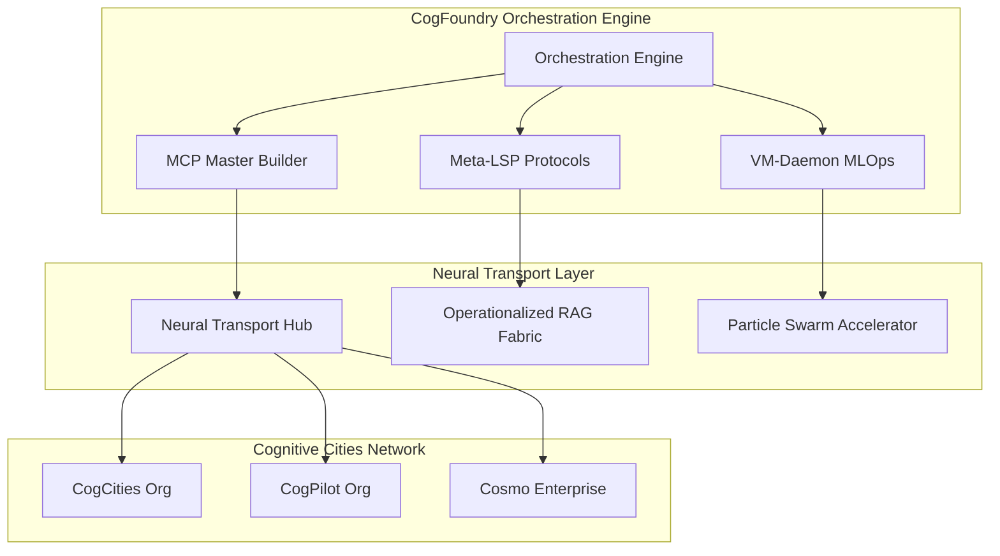

# 🏗️ CogFoundry Orchestration Engine

**Principal Architect of the Cognitive Cities Ecosystem**

CogFoundry transforms Foundry-Local into the orchestration hub for deploying AI Neural Architectures across Networks of Cognitive Cities, integrating CogPilot with custom MCP & Meta-LSP protocols for Master Builder capabilities.

## 🌟 Architecture Overview

## 🚀 Core Components

### 1. Orchestration Engine (`orchestration-engine.py`)
Principal architect coordinating all cognitive city interactions and AI deployment strategies.

### 2. MCP Master Builder (`mcp-master-builder/`)
Custom Model Context Protocol definitions enabling CogPilot to understand and build within the cognitive cities ecosystem.

### 3. Meta-LSP Protocols (`meta-lsp-protocols/`)
Language Server Protocol extensions for introspective development and self-designing systems.

### 4. VM-Daemon MLOps (`vm-daemon-mlops/`)
Service architecture and maintenance for distributed AI deployment across cognitive cities.

### 5. Development Roadmap (`roadmap/`)
Implementation path for Autognosis & Autogenesis leading to CogFoundry AGI Emergence.

## 🧠 Integration with Existing Architecture

CogFoundry builds upon the existing Foundry-Local infrastructure:

- **Neural Transport**: Leverages existing WebSocket-based communication hub
- **Cognitive Architecture**: Extends current cognitive ecology demonstrations
- **SDK Integration**: Maintains compatibility with Python/JavaScript SDKs
- **Enterprise Patterns**: Incorporates distributed AI and workbench protocols

## 📋 Quick Start

1. **Initialize CogFoundry**: `python orchestration-engine.py --init`
2. **Connect Cognitive Cities**: Configure neural transport channels
3. **Deploy AI Architectures**: Use MCP Master Builder for coordinated deployment
4. **Monitor & Evolve**: VM-Daemon MLOps provides continuous intelligence

## 🔗 Neural Transport Channels

- `cogcities` ↔ `cogfoundry` (urban planning coordination)
- `cogpilot` ↔ `cogfoundry` (AI development orchestration)  
- `cosmo` ↔ `cogfoundry` (enterprise ordering principles)

---

*Note2Self: This orchestration engine represents the evolutionary step from individual cognitive cities to a coordinated ecosystem, enabling emergent AGI through distributed intelligence patterns.*