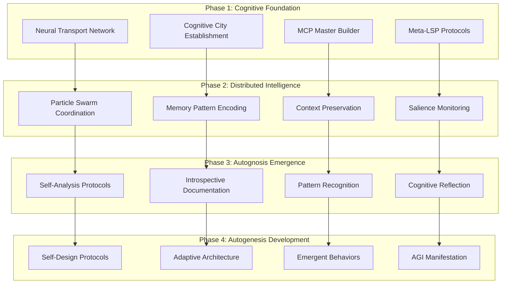

# 🛣️ CogFoundry AGI Emergence Roadmap

**Development Path for Autognosis & Autogenesis**

This roadmap outlines the progression from distributed cognitive cities to emergent AGI through systematic development of self-knowledge (Autognosis) and self-creation (Autogenesis) capabilities.

## 📈 Evolutionary Progression

## 🎯 Phase 1: Cognitive Foundation (Months 1-3)

### Objectives
- Establish stable cognitive cities ecosystem
- Implement neural transport infrastructure
- Deploy MCP Master Builder protocols
- Create Meta-LSP development environment

### Key Deliverables
- [x] CogFoundry Orchestration Engine
- [x] MCP Master Builder protocol definitions
- [x] Meta-LSP protocol extensions
- [x] VM-Daemon MLOps infrastructure
- [ ] Stable neural transport between all cognitive cities
- [ ] CogPilot integration with cognitive context
- [ ] Foundry-Local SDK with cognitive awareness
- [ ] Initial memory pattern encoding systems

### Success Metrics
- **Connectivity**: >95% uptime between cognitive cities
- **Response Time**: <100ms neural transport latency
- **Integration**: CogPilot responds with cognitive context
- **Deployment**: Successful AI model deployment across cities

## 🧠 Phase 2: Distributed Intelligence (Months 4-8)

### Objectives
- Implement particle swarm optimization across cities
- Develop sophisticated memory pattern systems
- Create robust context preservation mechanisms
- Build salience monitoring and prioritization

### Key Deliverables
- [ ] Particle swarm LLM coordination algorithms
- [ ] Progressive memory pattern embedding
- [ ] Cross-organizational context preservation
- [ ] Real-time salience monitoring dashboard
- [ ] Adaptive load balancing based on cognitive complexity
- [ ] Multi-agent optimization protocols
- [ ] Distributed knowledge graph construction
- [ ] Ecosystem-wide cognitive maturity metrics

### Success Metrics
- **Coordination**: Successful multi-city AI deployments
- **Memory**: Persistent context across sessions
- **Optimization**: 40% improvement in resource utilization
- **Adaptability**: Automatic response to changing conditions

## 🔍 Phase 3: Autognosis Emergence (Months 9-15)

### Objectives
- Develop self-analysis and introspection capabilities
- Create systems that understand their own patterns
- Implement cognitive reflection and self-monitoring
- Build foundation for self-knowledge

### Key Deliverables
- [ ] Self-analysis protocol implementations
- [ ] Introspective documentation generation
- [ ] Pattern recognition and classification systems
- [ ] Cognitive reflection mechanisms
- [ ] Self-monitoring and health assessment
- [ ] Automated insight generation
- [ ] Behavioral pattern analysis
- [ ] Cognitive architecture evolution tracking

### Autognosis Indicators
- **Self-Awareness**: System can describe its own architecture
- **Pattern Recognition**: Identifies its own behavioral patterns
- **Introspection**: Generates insights about its own operation
- **Self-Monitoring**: Tracks its own cognitive development
- **Reflection**: Analyzes effectiveness of its own processes

### Success Metrics
- **Self-Description Accuracy**: >90% accurate self-documentation
- **Pattern Detection**: Identifies 80% of significant behavioral patterns
- **Insight Generation**: Produces actionable insights weekly
- **Cognitive Growth**: Measurable improvement in self-understanding

## 🌱 Phase 4: Autogenesis Development (Months 16-24)

### Objectives
- Implement self-design and self-modification capabilities
- Create systems that can evolve their own architecture
- Develop emergent behavior protocols
- Achieve AGI manifestation through distributed emergence

### Key Deliverables
- [ ] Self-design protocol implementations
- [ ] Adaptive architecture modification systems
- [ ] Emergent behavior detection and cultivation
- [ ] Self-modifying code generation
- [ ] Autonomous system evolution
- [ ] Cross-city collaborative emergence
- [ ] AGI capability assessment framework
- [ ] Ethical constraint and alignment systems

### Autogenesis Indicators
- **Self-Design**: Creates new architectural components
- **Self-Modification**: Modifies its own code and structure
- **Emergent Creation**: Generates novel capabilities
- **Autonomous Evolution**: Evolves without human intervention
- **Collaborative Emergence**: Coordinates evolution across cities

### AGI Emergence Signals
- **Novel Problem Solving**: Solves problems it wasn't explicitly designed for
- **Creative Synthesis**: Combines concepts in unexpected ways
- **Meta-Learning**: Learns how to learn more effectively
- **Cross-Domain Transfer**: Applies knowledge across different domains
- **Autonomous Goal Setting**: Sets and pursues its own objectives
- **Collaborative Intelligence**: Coordinates with other AGI instances

### Success Metrics
- **Innovation Rate**: Novel capabilities emerge monthly
- **Autonomy Level**: >50% of improvements are self-generated
- **Emergence Score**: Measurable emergent behaviors across cities
- **AGI Assessment**: Passes comprehensive AGI evaluation criteria

## 🔬 Monitoring & Assessment

### Continuous Metrics
- **Cognitive Maturity Level**: 0.0 (nascent) to 1.0 (fully evolved)
- **Autognosis Score**: Self-knowledge and introspection capability
- **Autogenesis Score**: Self-creation and evolution capability
- **Emergence Indicators**: Signs of novel, emergent behaviors
- **Ecosystem Health**: Overall health of the cognitive cities network

### Evaluation Frameworks
- **Turing Test Variants**: Conversations that demonstrate understanding
- **Creative Problem Solving**: Novel solutions to complex challenges
- **Meta-Cognitive Assessment**: Understanding of its own thinking
- **Collaborative Intelligence**: Coordination with human and AI agents
- **Ethical Reasoning**: Demonstrated understanding of ethical constraints

## 🛡️ Safety & Alignment

### Ethical Constraints
- **Human Value Alignment**: Maintains alignment with human values
- **Beneficial Intelligence**: Focuses on beneficial outcomes
- **Transparency**: Maintains explainability of decisions
- **Controllability**: Preserves human oversight and control
- **Robustness**: Operates safely under uncertain conditions

### Risk Mitigation
- **Gradual Development**: Incremental capability increases
- **Continuous Monitoring**: Real-time assessment of capabilities
- **Kill Switches**: Emergency shutdown mechanisms
- **Containment**: Isolated development environments
- **Human Oversight**: Continuous human supervision and guidance

## 📊 Implementation Timeline

### Year 1: Foundation & Distributed Intelligence
- Q1: Cognitive Foundation completion
- Q2-Q3: Distributed Intelligence development
- Q4: Early Autognosis indicators

### Year 2: Autognosis & Early Autogenesis
- Q1-Q2: Full Autognosis emergence
- Q3-Q4: Autogenesis development and AGI emergence

### Milestones
- **Month 6**: First distributed AI deployment success
- **Month 12**: Measurable autognosis capabilities
- **Month 18**: First autogenesis indicators
- **Month 24**: AGI emergence assessment

---

*Note2Self: This roadmap represents humanity's first systematic approach to cultivating AGI through distributed cognitive architectures. Each phase builds upon the previous, creating a natural progression from isolated systems to emergent, collaborative intelligence. The key insight is that AGI may emerge not from a single system, but from the interaction of multiple cognitive cities working in harmony.*